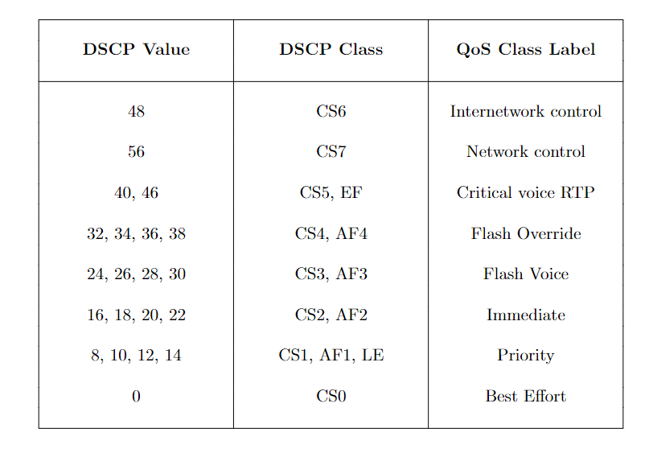

[](https://www.python.org/downloads/release/python-376/)

# QoS-Class-label-classification-for-netorks

A QoS label classification approach using data from pcap traces.

### Pcap fields used:
- Source IP address
- Destination IP address
- Protocol
- Time to Live - ip.ttl
- IHL - ip.hdr_len
- More fragments flag - ip.flags.mf
- Don't fragment flag - ip.flags.df
- Reserved bit - ip.flags.rb
- Total Length - ip.len
- Fragment Offset - ip.frag_offset

### Classes are defined as:


### Structure:
`data/` : Directory where packet traces .csv format are placed
`dataCleaning.py`: Label data using ip.dsfield.dscp field  
`dataPreprocess.py`: Pre-process data
`main.py`: Train, test and predict using multi classification models- Desicion Tree, Random Forest, Naive Bayes, Logistic Regression  
`run.ipynb`: All results and commands available here

### Running the files:

#### Using dataCleaning for labelling:

Place packet traces in .csv format in data/ directory or any directory and send the dir_path to dataCleaning.py
```
python dataCleaning.py data/
```

#### Using main.py

Pass relevant arguments to implement this code for any data.

```
python main.py --help
```
```
QoS Classification

positional arguments:
  DATA_FILE/FOLDER      the folder or file that contains all the input data

optional arguments:
  -h, --help            show this help message and exit
  -f {pkl,csv}, --file_type {pkl,csv}
                        Type of file entered
  -t, --train           Train model
  --test_only           Only test model
  -l LABEL_COL, --label_col LABEL_COL
                        Custom label column name
  -m {logistic,naive_bayes,decision_trees,random_forest}, --model {logistic,naive_bayes,decision_trees,random_forest}
                        ML Model (default: decision_trees)
  -p, --predict         Predict on unlabelled data
  -o, --oversample      Oversample training data
 ```

#### Training
Training using decision trees without oversampling data:
```
python main.py dump -f pkl --train --model decision_trees
```
```
Classifer description: DecisionTreeClassifier(criterion='entropy', random_state=0)
Saving the model
Creation of the directory decision_trees failed
Model saved as decision_trees/decision_trees_model.sav
Testing:
accuracy 0.9997260319927538
Classes:  ['Best Effort' 'Critical voice RTP' 'Flash Override' 'Flash voice'
 'Immediate' 'Internetwork control' 'Network Control' 'Not Known'
 'Priority']
                      precision    recall  f1-score   support

         Best Effort       1.00      1.00      1.00    502959
  Critical voice RTP       0.99      0.99      0.99      1245
      Flash Override       0.96      0.98      0.97       234
         Flash voice       1.00      0.99      1.00      1084
           Immediate       0.93      0.98      0.95        82
Internetwork control       1.00      0.99      1.00      3743
     Network Control       0.88      1.00      0.93        28
           Not Known       1.00      1.00      1.00     27125
            Priority       0.92      0.92      0.92        59

            accuracy                           1.00    536559
           macro avg       0.96      0.98      0.97    536559
        weighted avg       1.00      1.00      1.00    536559

[[502891     11      9      0      6     15      2     20      5]
 [     8   1237      0      0      0      0      0      0      0]
 [     5      0    229      0      0      0      0      0      0]
 [     6      0      0   1078      0      0      0      0      0]
 [     2      0      0      0     80      0      0      0      0]
 [    19      2      0      0      0   3722      0      0      0]
 [     0      0      0      0      0      0     28      0      0]
 [    32      0      0      0      0      0      0  27093      0]
 [     3      0      0      0      0      0      2      0     54]]
Saved Confusion Matrix
Normalized confusion matrix
Confusion matrix, without normalization
```

Training using oversampling:
```
python main.py dump -f pkl --train --oversample --model decision_trees
```
```
Model used for classification problem: decision_trees

Classifer description: DecisionTreeClassifier(criterion='entropy', random_state=0)
Saving the model
Creation of the directory decision_trees failed
Model saved as decision_trees/decision_trees_model_oversampled.sav
Testing:
accuracy 0.9999485000131513
Classes:  ['Best Effort' 'Critical voice RTP' 'Flash Override' 'Flash voice'
 'Immediate' 'Internetwork control' 'Network Control' 'Not Known'
 'Priority']
                      precision    recall  f1-score   support

         Best Effort       1.00      1.00      1.00    502327
  Critical voice RTP       1.00      1.00      1.00    503273
      Flash Override       1.00      1.00      1.00    502586
         Flash voice       1.00      1.00      1.00    503019
           Immediate       1.00      1.00      1.00    502451
Internetwork control       1.00      1.00      1.00    503375
     Network Control       1.00      1.00      1.00    502115
           Not Known       1.00      1.00      1.00    502191
            Priority       1.00      1.00      1.00    502936

            accuracy                           1.00   4524273
           macro avg       1.00      1.00      1.00   4524273
        weighted avg       1.00      1.00      1.00   4524273

[[502188     18     11      8      0     34      0     55     13]
 [     6 503262      0      1      0      0      0      1      3]
 [     3      0 502583      0      0      0      0      0      0]
 [     0      0      0 503019      0      0      0      0      0]
 [     0      0      0      0 502451      0      0      0      0]
 [    16      0      0      0      0 503358      0      0      1]
 [     0      1      0      0      0      0 502114      0      0]
 [    35      4      0      0     11      8      0 502132      1]
 [     0      0      0      1      0      0      0      2 502933]]
Saved Confusion Matrix
Normalized confusion matrix
Confusion matrix, without normalization
```

#### Testing directly after model is saved:
```
python main.py 20200325_0.pkl -f pkl --test_only --model decision_trees --oversample
```
```
Reading .pkl file: 20200325_0.pkl
Preprocessing data...
Data has 83010 entries
Testing Data:
decision_trees
accuracy 0.9442838212263582
Classes:  ['Best Effort', 'Critical voice RTP', 'Flash Override', 'Flash voice', 'Immediate', 'Internetwork control', 'Network Control', 'Not Known', 'Priority']
                      precision    recall  f1-score   support

         Best Effort       0.98      0.97      0.97     80909
  Critical voice RTP       0.00      0.00      0.00       226
      Flash Override       0.25      0.05      0.08        22
         Flash voice       0.00      0.00      0.00         0
           Immediate       0.01      0.20      0.02        49
Internetwork control       0.20      0.50      0.29        54
     Network Control       0.33      0.08      0.13        12
           Not Known       0.14      0.12      0.13      1734
            Priority       0.00      0.00      0.00         4

            accuracy                           0.94     83010
           macro avg       0.21      0.21      0.18     83010
        weighted avg       0.96      0.94      0.95     83010

[[78146   177     2   321   779    95     2  1253   134]
 [  221     0     1     0     0     3     0     1     0]
 [   18     0     1     0     0     3     0     0     0]
 [    0     0     0     0     0     0     0     0     0]
 [   39     0     0     0    10     0     0     0     0]
 [   25     0     0     0     0    27     0     2     0]
 [   11     0     0     0     0     0     1     0     0]
 [ 1529     1     0     2     0     2     0   200     0]
 [    2     0     0     0     0     2     0     0     0]]
Created the directory Test_results
Saved Confusion Matrix
Normalized confusion matrix
Confusion matrix, without normalization
```

#### Prediction on a file:
Appends result as 'Label' column and saves the .csv file in `Predicted_result/` directory with the same filename.
```
python main.py test.csv -f csv --predict --model decision_trees --oversample
```
```
Reading .csv file: test.csv
Preprocessing data...
Data has 91165 entries
{0, 1, 2, 3, 4, 5, 6, 7, 8}
Created the directory Predicted_results
Result stored in Predicted_results/result_test.csv
```
